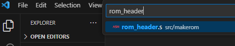
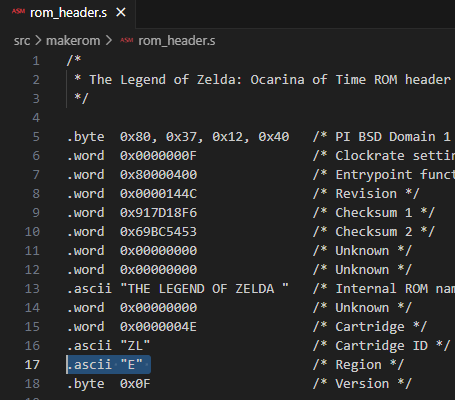
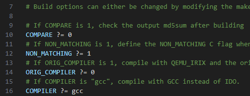
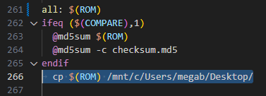
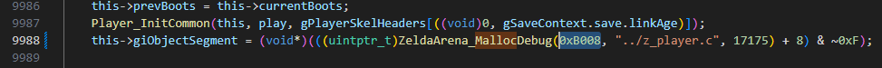

Initial ROM editing Set-Up
===========================================================

**1.- In VSCode press** *Ctrl+P* **to search for a file in the environment. Search for** ``rom_headers.s`` **and open it**

**2.- Change the region from “P” to “E” and press** *Ctrl+S* **to save the changes**

.. note::
    **P** is PAL and **E** is NTSC (PAL runs at 16 fps and NTSC runs at 20 fps)

**3.- Press again** *Ctrl+P*, **search** ``Makefile`` **and open it**

**4.- Modify lines 10, 12 and 16 as shown in the image**

**5.- Modify** *all:* **section to add a destination folder where save the modified rom when compiled**

.. note::
    You can find *all* section by pressing *Ctrl+F* and searching for ``all:``

.. code-block:: bash

   cp $(ROM) /mnt/c/Users/megab/Desktop/

.. warning::
    You need to use **tabulations** in this file. If you use spaces, it will fail

**6.- Solve opening in-game menu crash in emulator**
   * **1.- Press** *Ctrl+P* **in VSCode, search for a file called** ``z_map_exp.c`` **and open it**
   * **2.- Press** *Ctrl+F* **and search for** ``Minimap_Draw(``
   * **3.- Change the** ``<=`` **in the first** *if* **statement with only** ``<``

.. image:: ../images/setup/initial_rom_edit/solve_map.png

|
|

**EXTRA: Dedicate more memory to show link holding item models**

This step is **comletly optional** and it will only be useful if, in the future, you want to model an obtainable item wich size is greater than the maxumum **(12Kb)**

What we are going to do is increase that maximum size to **44Kb** and this should not have any negative impact in the game (at least in emulator)

.. note::
    The models that I'm talking about is the ones that are used when link gets a new item (geting kokiri sword from the chest and having it rotate over links hands)

* **1.- Press** *Ctrl+P* **in VSCode, search for a file called** ``z_player.c`` **and open it**
* **2.- Press** *Ctrl+F* **and search for** ``malloc``
* **3.- Change the** ``0x3008`` **inside the parentesis with** ``0xB008``

